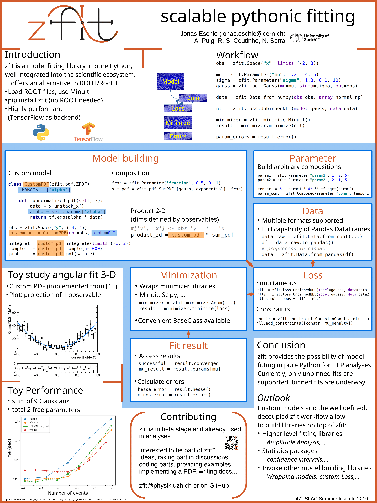
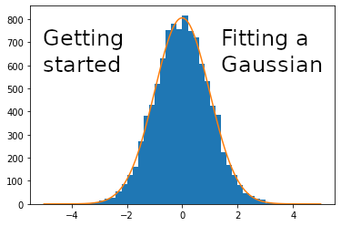

================================
zfit: scalable, pythonic fitting
================================

|zfit_logo|

Click on the links or the images to explore zfit.

What is zfit?
-------------

zfit is a (likelihood) model fitting library using analytic distributions
such as a Normal, Poisson. It is powerful and highly flexible such that it
can be used to analyse data in High Energy Physics experiments like CERN.

(:ref:`This looks similar to SciPy distributions and fitting, why zfit? <scipy-vs-zfit>`)

|tutorial10| |classical_poster|

Introduction tutorial
----------------------

For an introduction into zfit

.. toctree::
    :maxdepth: 1

    pages/5_minutes_to_zfit
    ../zfit-tutorials/introduction/Introduction

What can zfit do
----------------

It is built to be powerful and flexible enough to satisfy the
strong requirements of High Energy Physics, but is a general purpose library. It focuses strongly on two points,
namely:

- **performance**: it is built on top of the *low-level* components of TensorFlow. This is a
  mathematical library very similar to Numpy but with the native ability to compile
  parts and imply various optimizations, including GPU support and automatic gradients.

.. toctree::
    :maxdepth: 1

    ../zfit-tutorials/TensorFlow/HPC_with_TensorFlow

- **custom models**: While comparable libraries offer usually a limited set of
  model combinations or the possibility to implement custom models, zfit supports `a variety of
  composed and multidimensional distributions <https://mybinder.org/v2/gh/zfit/zfit-tutorials/9fc3fb862f078d4
  10288142a354c78edfa0d0b05?filepath=20%20-%20Composite%20Models.ipynb>`_, such as
  products and sums, out-of-the-box.
  Implementing a custom model with your own function
  (`you can try your own shape  <https://mybinder.org/v2/gh/zfit/zfit-tutorials/9fc3fb862f078d410288142a354c78edfa0d0b05?filepath=60%20-%20Custom%20PDF.ipynb>`_)
  is straightforward and allows for arbitrary
  complicated functions - even functions reaching thousands of lines of code;
  if analytical methods for integration and sampling are not
  available, it automatically falls back to numerical methods. No further care needs to
  be taken by the user therefore.

.. toctree::
    :maxdepth: 1

    ../zfit-tutorials/components/20 - Composite Models
    ../zfit-tutorials/components/60 - Custom PDF
    ../zfit-tutorials/guides/custom_models

